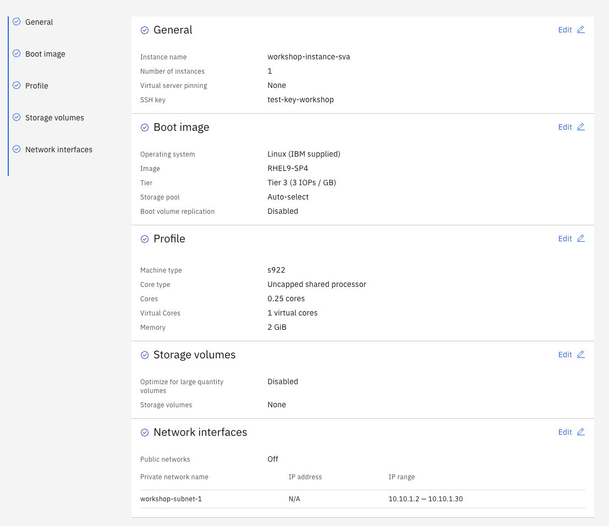
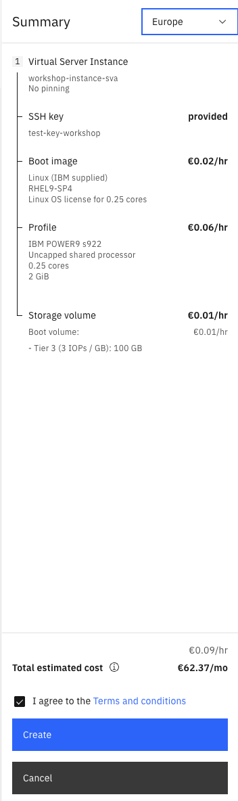

# 01_Workspace_anlegen

### Schritt 1 - Login + Navigation zu PowerVS:

- Melden Sie sich mit ihren Login-Daten in ihrem IBM Cloud Account an 
- Suchen Sie im oberen Navigationsbalken nach ``Catalog`` 
- Suchen Sie im Suchfeld des Katalogs nach **PowerVS**
- Wählen Sie **Power Virtual Server aus**

 

----
### Schritt 2 - PowerVS Workspace erstellen:

- klicken Sie auf das Feld ``Create a Workspace``
- wählen Sie als **Location type** - **IBM data center** 
- wählen Sie als **Location** - **eu-de-1** oder **eu-de-2** (-> Datacenter in Frankfurt, es kann natürlich theoretisch jedes verfügbare Datacenter gewählt werden)

> [!NOTE]
> Eine Auflistung der Standorte an denen Power Virtual Server zur Verfügung stehen finden Sie hier: [Power Virtual Server Regions](https://cloud.ibm.com/docs/power-iaas?topic=power-iaas-ibm-cloud-reg)

- gehen Sie anschließend auf ``Continue``
- wählen Sie einen Namen für den Workspace
- als **Resource group** wählen Sie die Ihnen zugeordente Ressourcengruppe 
- **User tags** und **Access management tags** können im Moment ignoeriert werden
- gehen Sie anschließend auf ``Continue``
- der Punkt Monitoring ist optional  (zur optimalen Fehlerbehebung und der Reduzierung von Ausfallzeiten empfohlen) 
- gehen Sie anschließend auf ``Finish``
- setzen Sie den Haken bei ***I agree to the Terms and Conditions*** und wählen Sie zum Schluss ``Create``

 

> [!NOTE]
> Beim reinen anlegen eines Workspaces entstehen keine Kosten

- nachdem der Workspace erstellt ist sollte dieser jetzt in der Ansicht **Workspaces** sichtbar sein
- klicken Sie auf Ihren erstellten Workspace um mit den nächsten Schritten fortfahren zu können

> [!TIP]
> Falls Sie von irgendeinem Punkt in der IBM Cloud aus wieder schnell zu ihrem Workspace navigieren möchten, wählen sie über die Seitenleiste -> ``Resource list`` und suchen Sie unter **Compute** Ihren Workspace
>
> 

----
### Schritt 3:  Subnet und SSH-Key erstellen

#### Subnetz erstellen

- um ein Subnetz zu erstellen navigieren Sie innerhalb ihres Workspaces unter **Networking** auf **Subnets**

 

- gehen Sie auf der rechten Seite auf das Feld `Create Subnet +`
- bennen Sie ihr Subnet
- vergeben Sie Ihre für diese Übung vorgegebne Subnet-Adresse 
- lassen Sie die restlichen Werte standardmäßg und klicken sie auf ``Create Subnet``

 

#### SHH-Key erstellen

- um einen SSH-Key zu erstellen navigieren Sie innerhalb ihres Workspaces unter **Compute** auf **SSH-keys**

 

- gehen Sie auf der rechten Seite auf das Feld ``Create SSH-Key``
- vergeben Sie einen Namen für den Key und fügen Sie den öffentlichen Schlüssel ihres SSH-Keys im unteren Feld ein und drücken Sie auf ``Add SSH key``

> [!NOTE]
> Der SSH-Key sollte im vorhinein mit z.b. ``ssh-keygen`` (für Linux und MacOs) erstellt werden
> **Beispiel:** ``ssh-keygen -t rsa -b 4096 -C "test-key"``
> Mehr Infos zum generieren und nutzen von SSH-Keys in der offiziellen IBM Cloud Dokumentation -> [generieren und nutzen von SSH-Keys](https://cloud.ibm.com/docs/power-iaas?topic=power-iaas-creating-ssh-key)

 

----
### Schritt 4: LPAR erstellen 

- um die LPAR zu erstellen gehen Sie über **Compute** auf **Virtual Server Instances +**
- Vergeben Sie zuerst einen Namen für Ihre Instance
- wählen Sie für **Number of instances** 1 aus
- wählen Sie unter **SSH key** den Key aus den Sie im vorherigen Schritt erstellt haben

> [!NOTE]
> Nehmen Sie sich einen die Zeit, um sich über das Info-Icon mit den erweiterten Einstellungsmöglichkeiten zur Provisionierung von Instanzen vertraut zu machen
> weitere Informationen finden Sie in der offiziellen Dokumentation: [Power Virtual Server Dokumentation](https://cloud.ibm.com/docs/power-iaas?topic=power-iaas-getting-started)

- lassen Sie die restlichen Felder auf den Standardeinstellungen und gehen Sie weiter mit ``Continue``
- wählen Sie ein Betriebssystem aus 
- wählen Sie ein Image aus 
- als Tier reicht für die Workshop Zwecke **Tier 3**

> [!NOTE]
> Für mehr Informationen über Storage Tiers lesen Sie in der Dokumentation nach: [Storage Tiers](https://cloud.ibm.com/docs/power-iaas?topic=power-iaas-on-cloud-architecture#storage-tiers) 

- wählen Sie für Storage pool ``Auto-select``
- lassen Sie die restlichen Felder auf den Standardeinstellungen und gehen Sie weiter mit ``Continue``
- wählen Sie eine Power Maschine aus, welche Sie provisionieren möchten (für die Workshop Zwecke reicht z.b. eine s922)
- für **Core type** bleiben wir mit der Einstellung **Shared uncapped**
- für **Cores** wählen wir 0,25
- für **Virtual Cores** bleiben wir mit der Standardeinstellung 1
- für **Memory (GiB)** wählen wir 2GB
- gehen Sie weiter mit ``Continue``
- **Storage volumes** lassen wir erst mal aus, diese werden in einem weiteren Teil des Workshops nochmal behandelt
- gehen Sie weiter mit ``Continue``
- gehen Sie unter **Network interfaces** auf ``Attach exisitng network + ``
- wählen Sie ihr zuvor erstelltes Subnet aus, lassen Sie die restlichen Einstellungen wie sie sind und drücken Sie ``Attach``
- wählen Sie zum Schluss ``Finish``, reviewen Sie den angezeigten Preis, setzen Sie den Haken bei ***I agree to the Terms and conditions*** und wählen Sie ``Create``

