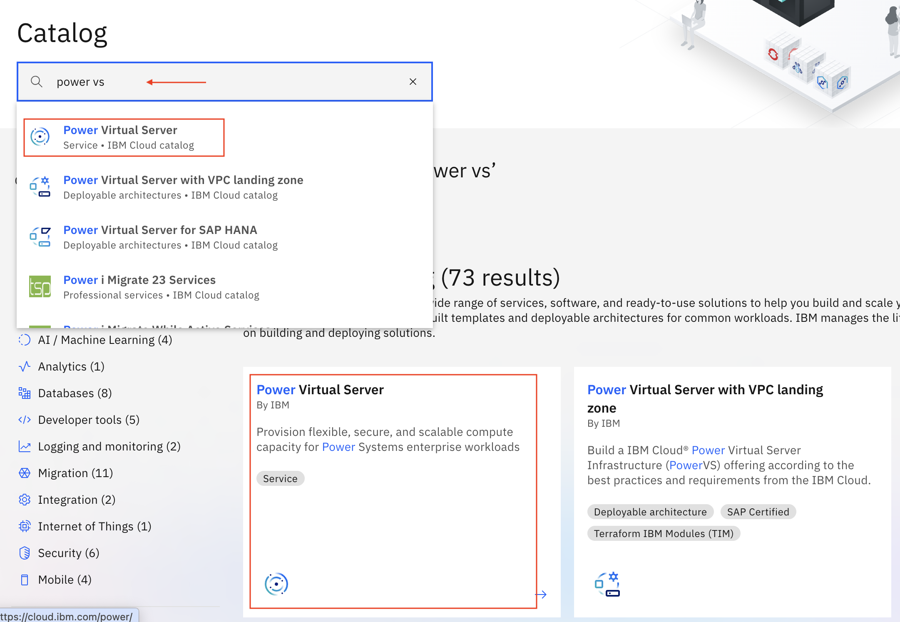
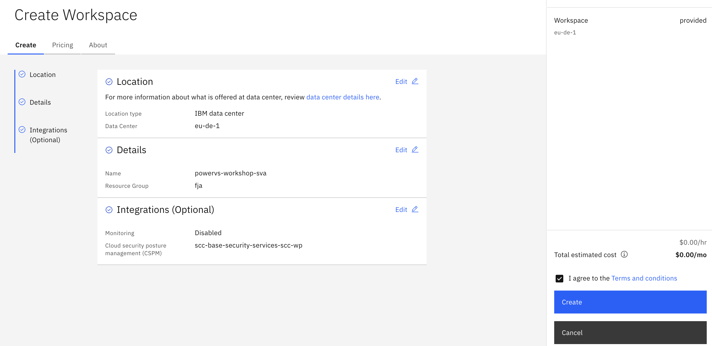
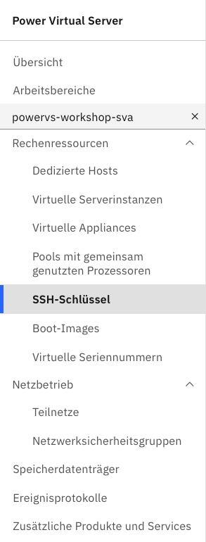

# 01_Workspace_anlegen

### Schritt 1 - Login + Navigation zu PowerVS:

- Melden Sie sich mit ihren Login-Daten in ihrem IBM Cloud Account an 

- Suchen Sie im oberen Navigationsbalken nach ``Katalog`` 

- Suchen Sie im Suchfeld des Katalogs nach **PowerVS**

- Wählen Sie **Power Virtual Server aus**

 

 

----
### Schritt 2 - PowerVS Workspace erstellen:

- klicken Sie auf das Feld ``Arbeitsbereich erstellen``

- wählen Sie als **Standorttyp** - **IBM data center** 

- wählen Sie als **Position** - **eu-de-1** oder **eu-de-2** (-> Datacenter in Frankfurt, es kann natürlich theoretisch jedes verfügbare Datacenter gewählt werden)

> [!NOTE]
> Eine Auflistung der Standorte an denen Power Virtual Server zur Verfügung stehen finden Sie hier: [Power Virtual Server Regions](https://cloud.ibm.com/docs/power-iaas?topic=power-iaas-ibm-cloud-reg)

- gehen Sie anschließend auf ``Weiter``

- wählen Sie einen Namen für den Workspace

- als Ressourcengruppe wählen Sie die Ihnen zugeordente Ressourcengruppe 

- **Benutzertag** und **Zugriffsmanagementtags** können im Moment ignoeriert werden

- gehen Sie anschließend auf ``Weiter``

- der Punkt Monitoring ist optional  (zur optimalen Fehlerbehebung und der Reduzierung von Ausfallzeiten empfohlen) 

- gehen Sie anschließend auf ``Fertigstellen``

- setzen Sie den Haken bei ***Ich akzeptiere die Bedingungen*** und wählen Sie zum Schluss ``Erstellen``

 

 

- nachdem der Workspace erstellt ist sollte dieser jetzt in der Ansicht **Arbeitsbereiche** sichtbar sein

- klicken Sie auf Ihren erstellten Arbeitsbereich um mit den nächsten Schritten fortfahren zu können

 

> [!TIP]
> Falls Sie von irgendeinem Punkt in der IBM Cloud aus wieder schnell zu ihrem Workspace navigieren möchten, wählen sie über die Seitenleiste -> ``Ressourcenliste`` und suchen Sie unter **Datenverarbeitungsfunktionalität** Ihren Workspace
>
> 
 

----
### Schritt 3:  Subnetz, SSH-Key und LPAR erstellen

#### Subnetz erstellen

- um ein Subnetz zu erstellen navigieren Sie innerhalb ihres Workspaces unter **Netzbetrieb** auf **Teilnetze**

 

 

- gehen Sie auf der rechten Seite auf das Feld `Teilnetz erstellen+`

- bennen Sie ihr Teilnetz

- vergeben Sie Ihre für diese Übung vorgegebne Subnetz-Adresse 

- lassen Sie die restlichen Werte standardmäßg und klicken sie auf ``Teilnetz erstellen``

 

 

#### SHH-Key erstellen

- um einen SSH-Key zu erstellen navigieren Sie innerhalb ihres Workspaces unter **Rechenressourcen** auf **SSH-Schlüssel**

 

 

- gehen sie auf der rechten Seite auf das Feld ``SSH-Schlüssel erstellen``

- vergeben sie einen Namen für den Key und fügen sie den öffentlichen Schlüssel ihres SSH-Keys im unteren Feld ein

> [!NOTE]
> Der SSH-Key sollte im vorhinein mit z.b. ``ssh-keygen`` (für Linux und MacOs) erstellt werden
>
> Beispiel: ``ssh-keygen -t rsa -b 4096 -C "test-key"``
>
> Mehr Infos zum generieren und nutzen von SSH-Keys in der offiziellen IBM Cloud Dokumentation -> [generieren und nutzen von SSH-Schlüsseln](https://cloud.ibm.com/docs/power-iaas?topic=power-iaas-creating-ssh-key)