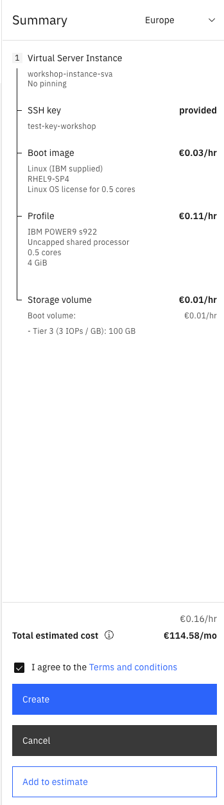

# 01_Workspace_anlegen

### Schritt 1 - Login + Navigation zu PowerVS:

- Melden Sie sich mit ihren Login-Daten in Ihrem IBM Cloud Account an 
- Suchen Sie im oberen Navigationsbalken nach ``Catalog`` 
- Schen Sie im Suchfeld des Katalogs nach **PowerVS**
- Wählen Sie **Power Virtual Server aus**

 

----
### Schritt 2 - PowerVS Workspace erstellen:

- Klicken Sie auf das Feld ``Create a Workspace``
- Wählen Sie als **Location type** - **IBM data center** 
- Wählen Sie als **Location** - **eu-de-1** oder **eu-de-2** (-> Datacenter in Frankfurt, es kann natürlich theoretisch jedes verfügbare Datacenter gewählt werden)

> [!NOTE]
> Eine Auflistung der Standorte an denen Power Virtual Server zur Verfügung stehen finden Sie hier: [Power Virtual Server Regions](https://cloud.ibm.com/docs/power-iaas?topic=power-iaas-ibm-cloud-reg)

- Gehen Sie anschließend auf ``Continue``
- Wählen Sie einen Namen für den Workspace
- Als **Resource group** wählen Sie die Ihnen zugeordente Ressourcengruppe 
- **User tags** und **Access management tags** können im Moment ignoeriert werden
- Gehen Sie anschließend auf ``Continue``
- Der Punkt Monitoring ist optional (zur optimalen Fehlerbehebung und der Reduzierung von Ausfallzeiten empfohlen)
- Gehen Sie anschließend auf ``Finish``
- Setzen Sie den Haken bei ***I agree to the Terms and Conditions*** und wählen Sie zum Schluss ``Create``

 

> [!NOTE]
> Beim reinen anlegen eines Workspaces entstehen keine Kosten

- Nachdem der Workspace erstellt ist sollte dieser jetzt in der Ansicht **Workspaces** sichtbar sein
- Klicken Sie auf Ihren erstellten Workspace um mit den nächsten Schritten fortfahren zu können

> [!TIP]
> Falls Sie von irgendeinem Punkt in der IBM Cloud aus wieder schnell zu ihrem Workspace navigieren möchten, wählen sie über die Seitenleiste -> ``Resource list`` und suchen Sie unter **Compute** Ihren Workspace
>
> 

----
### Schritt 3:  Subnet und SSH-Key erstellen

#### Subnetz erstellen

- Um ein Subnet zu erstellen navigieren Sie innerhalb ihres Workspaces unter **Networking** auf **Subnets**

 

- Gehen Sie auf der rechten Seite auf das Feld `Create Subnet +`
- Benennen Sie Ihr Subnet
- Vergeben Sie Ihre für diese Übung vorgegebne Subnet-Adresse 
- Lassen Sie die restlichen Werte standardmäßig und klicken sie auf ``Create Subnet``

 

#### SHH-Key erstellen

- Um einen SSH-Key zu erstellen navigieren Sie innerhalb Ihres Workspaces unter **Compute** auf **SSH-keys**

 

- Gehen Sie auf der rechten Seite auf das Feld ``Create SSH-Key``
- Vergeben Sie einen Namen für den Key und fügen Sie den öffentlichen Schlüssel ihres SSH-Keys im unteren Feld ein und drücken Sie auf ``Add SSH key``

> [!NOTE]
> Der SSH-Key sollte vorher mit z.b. ``ssh-keygen`` (für Linux und MacOs) erstellt werden
> **Beispiel:** ``ssh-keygen -t rsa -b 4096 -C "test-key"``
> Mehr Infos zum generieren und nutzen von SSH-Keys in der offiziellen IBM Cloud Dokumentation -> [generieren und nutzen von SSH-Keys mit Power Virtual Servern](https://cloud.ibm.com/docs/power-iaas?topic=power-iaas-creating-ssh-key)

 

----
### Schritt 4: LPAR erstellen 

- Um die LPAR zu erstellen gehen Sie über **Compute** auf **Virtual Server Instances +**
- Vergeben Sie zuerst einen Namen für Ihre Instanz
- Wählen Sie für **Number of instances** **1** aus
- Wählen Sie unter **SSH key** den Key aus den Sie im vorherigen Schritt erstellt/angelegt haben

> [!NOTE]
> Nehmen Sie sich die Zeit, um sich über das Info-Icon mit den erweiterten Einstellungsmöglichkeiten bei der Provisionierung von Instanzen vertraut zu machen
> weitere Informationen finden Sie in der offiziellen Dokumentation: [Power Virtual Server Dokumentation](https://cloud.ibm.com/docs/power-iaas?topic=power-iaas-getting-started)

- Lassen Sie die restlichen Felder auf den Standardeinstellungen und gehen Sie weiter mit ``Continue``
- Wählen Sie ein Betriebssystem aus 
- Wählen Sie ein Image aus 
- Als Tier reicht für diesen Workshop **Tier 3**

> [!NOTE]
> Für mehr Informationen über Storage Tiers lesen Sie in der Dokumentation nach: [Storage Tiers](https://cloud.ibm.com/docs/power-iaas?topic=power-iaas-on-cloud-architecture#storage-tiers) 

- Wählen Sie für Storage pool ``Auto-select``
- Lassen Sie die restlichen Felder auf den Standardeinstellungen und gehen Sie weiter mit ``Continue``
- Wählen Sie eine Power Maschine aus, welche Sie provisionieren möchten (für die Workshop Zwecke reicht z.b. eine s922)
- Für **Core type** bleiben wir bei der Einstellung **Shared uncapped**
- Für **Cores** wählen wir 0,5 (wird im weiteren Verlauf des Workshops angepasst)
- Für **Virtual Cores** bleiben wir mit der Standardeinstellung 1
- Für **Memory (GiB)** wählen wir 4GB (wird im weiteren Verlauf des Workshops angepasst)
- Gehen Sie weiter mit ``Continue``
- **Storage volumes** lassen wir erst mal aus, diese werden in einem weiteren Teil des Workshops nochmal behandelt
- Gehen Sie weiter mit ``Continue``
- Gehen Sie unter **Network interfaces** auf ``Attach exisitng network + ``
- Wählen Sie ihr zuvor erstelltes Subnet aus, lassen Sie die restlichen Einstellungen wie sie sind und drücken Sie ``Attach``
- Wählen Sie zum Schluss ``Finish``, reviewen Sie den angezeigten Preis, setzen Sie den Haken bei ***I agree to the Terms and conditions*** und wählen Sie ``Create``

- Die Provisionierung der Insanz kann jetzt einige Minuten in Anspruch nehmen
- Um auf der Instanzu zu arbeiten müssen Sie sich nach erfolgreicher Provisonierung zuerst mit dem in der VPC liegendem JumpServer per SSH verbinden ``ssh -i <publickey> root@<IP_Jump_Server>``
    - Geben Sie dem JumpServer optional ihren Power VS SSH-Key per ssh-agent mit, um diesen nicht auf dem JumpServer ablegen zu müssen
    - Aktivieren Sie dazu zuerst den ssh-agent ``eval $(ssh-agent -s)``
    - Geben Sie dem Agent den privaten SSH_Key für den Zugriff auf die PowerVS Instanz mit ``ssh-add <private_key_PowerVS>``
    - Gehen Sie über ssh auf den Jump Server mit der Angabe von **-A** ``ssh -A -i <publickey> root@<IP_Jump_Server>``
- Da die VPC und die PowerVS Instanz per **Transit Gateway verbunden sind** kann über den Jumpserver nun auf die PowerVS Instanz per SSH zugegriffen werden
    - ``ssh root@<IP_PowerVS_Instanz>``
