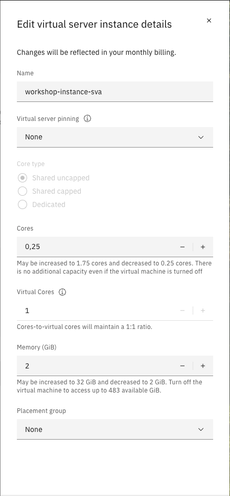
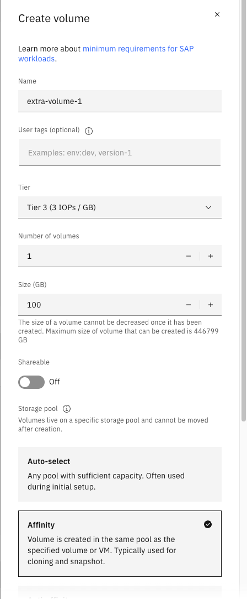
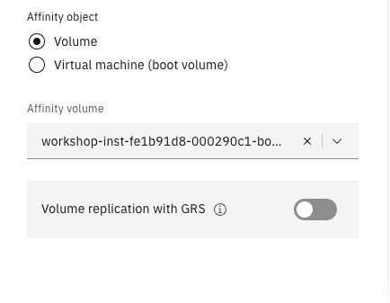

# 02_LPAR_Management

### LPAR rezising

- Um die Spezifikationen ihrer LPAR zu ändern, wählen Sie zuerst Ihre LPAR unter **Compute** und dann unter **Virtual Server Instances** ihre Instanz aus 
- Wenn Sie Ihre Instanz offen haben klicken Sie in dem Feld **Virtual server instance details**, unter dem Namen ihrer Instanz, rechts in der oberen Ecke auf ``Edit details``
- In der Ansicht haben Sie einige Optionen um beispielweise **Cores** oder **Memory** zu ändern
- Ändern Sie zu Testzwecken **Cores** von **0,5** auf **0,25** und **Memory** von **4GB** auf **2GB**
- bestätigen Sie Ihre Änderungen indem Sie den Haken bei ***I agree to the Terms and conditions*** setzen und klicken Sie auf ``Save edits and order klicken``

 
 - das rezising kann nach erfolgter Bestätigung einige Minuten in Anspruch nehmen, Sie sollten neben dem Namen Ihrer Instanz eine kleine "Ladeanimation sehen"
 - nach einigen Minuten müsste die LPAR nun erfolgreich rezised sein 

----
### Zugriff über die Console

----
### Volume hinzufügen 

- Um ein Volume an eine LPAR hinzuzufügen gehen Sie innerhlab Ihrer Instant über den Bereich **Attached Volumes** auf ``Create volume +``
    - Ihre bereits vorhandenen Volumes sollten Ihnen ebenfalls in der Übersicht angezeigt sein, es ist auch möglich nach Volumes über das Suchfeld zu suchen 
- vergeben Sie für Ihr neues Volume zunächst einen Namen
- als **Tier** reicht für diesen Workshop **Tier 3**
- für **Number of volumes** bleiebn wir beim Standardwert 1
- den Schalter **Shareable** lassen für für den Workshop zunächst aus
- für **Storage Pool** können wir **Affinity** wählen um das Volume im selben Pool wie ein spezifiziertess Volume oder VM zu erstellen 
- als Affinity Volume wählen wir Volume um das Volume im selben Pool wie ein wählbares Volume zu erstellen
- als nächstes wählen wir ein spezfiisches Volume als Affinity Object aus
    - beim erstellen der LPAR wurde ein Volume mit erstellt, wir wählen dieses als Affinity volume aus
        - den Namen des Volumes finden Sie unter **Attached Volumes**
- bestätigen Sie Ihre Änderungen indem Sie den Haken bei ***I agree to the Terms and conditions*** setzen und klicken Sie auf ``Create and attach``

