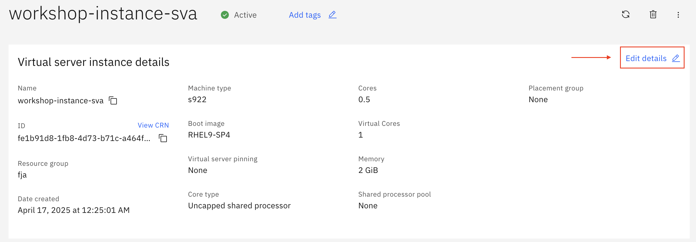
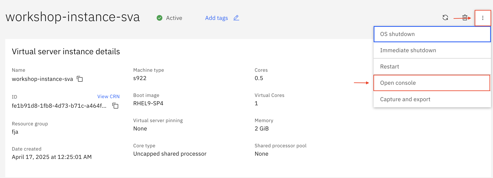
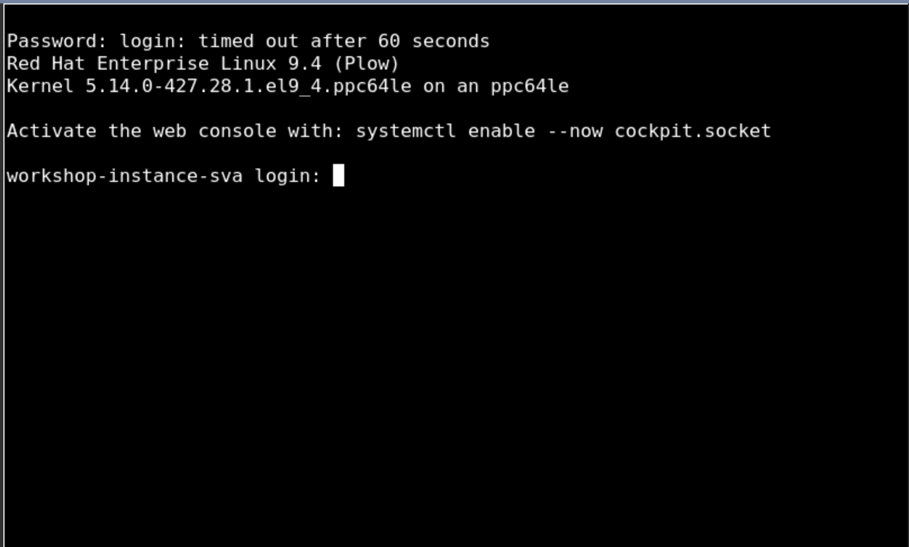
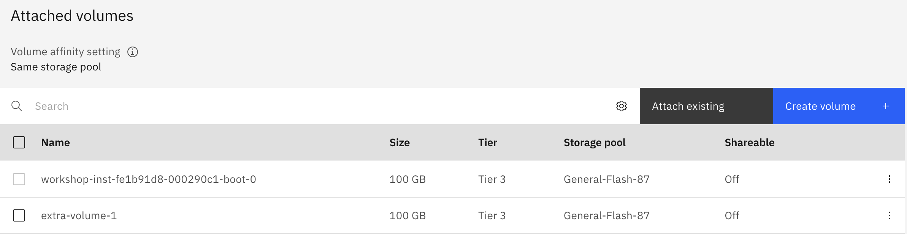

# 02_LPAR_Management

### LPAR resizing

- Um die Spezifikationen Ihrer LPAR zu ändern, wählen Sie zuerst Ihre LPAR unter **Compute** und dann unter **Virtual server instances** Ihre Instanz aus 
- Wenn Sie Ihre Instanz offen haben klicken Sie in dem Kasten **Virtual server instance details**, welcher sich oben unter dem Namen Ihrer Instanz befindet, rechts in der oberen Ecke auf ``Edit details``

- In der Ansicht haben Sie einige Optionen um beispielweise **Cores** oder **Memory** zu ändern
- Ändern Sie zu Testzwecken **Cores** von **0,5** auf **0,25** und **Memory** von **4GB** auf **2GB**
- Bestätigen Sie Ihre Änderungen indem Sie den Haken bei ***I agree to the Terms and conditions*** setzen und klicken Sie auf ``Save edits and order klicken``

 
 - Das Resizing kann nach erfolgter Bestätigung einige Minuten in Anspruch nehmen, Sie sollten neben dem Namen Ihrer Instanz eine kleine "Ladeanimation sehen"
 - nach einigen Minuten müsste die LPAR nun erfolgreich rezised sein 

----
### Zugriff über die Console

- Um über das Cloud Portal direkt auf die Console zuzugreifen gehen Sie rechts oben auf der höhe des Namens Ihrer Instanz, auf das Icon mit den 3 Punkten, klicken Sie darauf und wählen Sie anschließend ``Open console``

- Im Anschluss öffnet sich Ihre Console in einem extra Fenster, in welchem Sie aufgefordert werden Ihren User-Login und Ihr Passwort einzugeben

- Melden Sie sich mit Ihren Daten an um auf die LPAR zuzugreifen

----
### Volume hinzufügen 

- Um ein Volume an eine LPAR hinzuzufügen, gehen Sie innerhalb Ihrer Instanz in den Bereich Attached Volumes und klicken auf ``Create volume + ``
    - Ihre bereits vorhandenen Volumes werden Ihnen ebenfalls in der Übersicht angezeigt. Sie können auch nach Volumes über das Suchfeld suchen
- Vergeben Sie zunächst einen Namen für Ihr neues Volume
- Als **Tier** wählen Sie für diesen Workshop **Tier 3**
- Bei **Number of volumes** bleiben wir beim Standardwert 1
- Den Schalter **Shareable** lassen wir für den Workshop zunächst deaktiviert
- Für **Storage Pool** wählen wir **Affinity**, um das Volume im selben Pool wie ein spezifiziertes Volume oder eine VM zu erstellen 
- Als Affinity Volume wählen wir **Volume** um das neue Volume im selben Pool wie ein wählbares Volume zu erstellen
- Als nächstes wählen wir ein spezifisches Volume als **Affinity Object** aus. 
    - Beim Erstellen der LPAR wurde ein Volume mit erstellt, wir wählen dieses als Affinity Volume aus. Den Namen des Volumes finden Sie unter Attached Volumes.
- Bestätigen Sie Ihre Änderungen indem Sie den Haken bei ***I agree to the Terms and conditions*** setzen und klicken Sie auf ``Create and attach``

- Nach einer kurzen Wartezeit sollte das Volume attached sein

