# 03_CLI_+_Storage
### IBM Cloud-CLI lokal nutzen

- Um die IBM Cloud CLI lokal zu nutzen öffnen Sie ihr Terminal und führen Sie das folgende Skript je nach Betriebssystem aus: 

    - MacOS: ``curl -fsSL https://clis.cloud.ibm.com/install/osx | sh``
    - Linux: ``curl -fsSL https://clis.cloud.ibm.com/install/linux | sh``
    - Windows: ``iex (New-Object Net.WebClient).DownloadString('https://clis.cloud.ibm.com/install/powershell')``
        - Wenn Sie bei der Windows Installation  auf Fehler wie " The underlying connection was closed: An unexpected error occurred on a send stoßen, stellen Sie sicher, dass Sie .Net Framework 4.5 oder höher installiert haben. Versuchen Sie außerdem, das TLS 1.2-Protokoll durch Ausführen des folgenden Befehls zu aktivieren: 
        ``[Net.ServicePointManager]::SecurityProtocol = [Net.SecurityProtocolType]::Tls12``

- Nach erfolgreicher Installation könenn Sie sich mit dem Befehl``ibmcloud login`` an Ihrem Account anmelden
    -  Sollten Sie beim versuch der Anmeldung einen Fehler erhalten wie ***Sie verwenden eine eingebundene Benutzer-ID; verwenden Sie einen Einmalkenncode ( ibmcloud login --sso ) oder einen API-Schlüssel ( ibmcloud login --apikey key or @key_file ) zur Authentifizierung.*** , dann holen Sie sich ihren Einmalkenncode im IBM Cloud Portal.
       - Den Einmalkenncode zur Anmeldung in der CLI finden Sie, indem Sie oben in der Navigationsleiste ganz rechts auf das Profil-Icon klicken und anschließend auf ``Log in to CLI and API`` gehen. Kopieren Sie nun den Login-Befehl für die IBM Cloud CLI und fügen Sie ihn in Ihr Terminal ein. 
       - Sie sollten nun lokal über die CLI in Ihrem Account angemeldet sein.

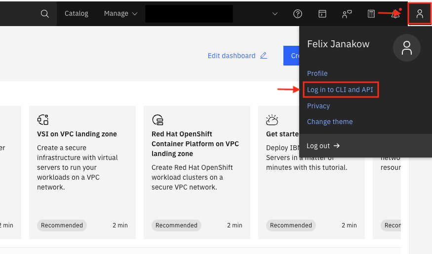

>[!TIP]
> Um immer die neuste Version der CLI zu nutzen führen Sie den Befehl ``ibmcloud update`` aus
>
> Die aktuelle Version Ihrer CLI finden Sie über ``ibmcloud -v`` heraus

- Da wir mit PowerVS arbeiten möchten brauchen wir für unsere CLI noch ein Plugin
- Das Power-IaaS Plugin installieren wir über den Befehl ``ibmcloud plugin install power-iaas``

>[!NOTE]
> Eine Liste aller Plugins finden Sie über ``ibmcloud plugin repo-plugins``
>
> Um Ihre bereits installieren Plugins aufzulisten nutzen Sie ``ibmcloud plugin list``
>
> Um Plugins zu aktualisieren nutzen Sie ``ibmcloud plugin update``

>[!NOTE]
> Weitere Infos über die IBM Cloud CLI finden Sie in der offiziellen Dokumentation: [IBM Cloud-CLI](https://cloud.ibm.com/docs/cli?topic=cli-install-ibmcloud-cli)

---
### IBM Cloud-CLI im GUI

- Es ist natürlich auch möglich die IBM Cloud CLI im IBM Cloud Portal zu nutzen, wählen sie dafür oben in der Navigationsbar das Icon aus welches wie ein Terminal aussieht und starten Sie per Klick eine neue Cloud Shell

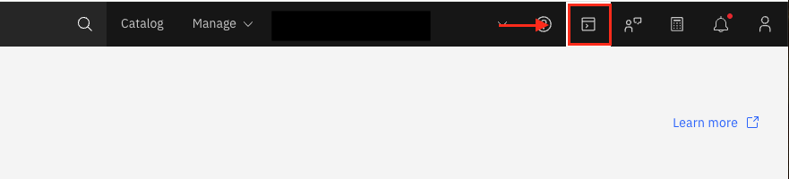

- Sie können jetzt direkt mit der IBM Cloud CLI interagieren, tippen Sie beispielweise ``ibmcloud help`` ein um Hilfe zu bekommen 
- Testen Sie den Befehl ``ibmcloud plugin list``, sie sehen dass in der Cloud Shell bereits alle Plugins installiert sind

>[!NOTE]
> Um sich mit allgemeinen Befehlen der IBM Cloud-CLI bekannt zu machen schauen sie in die offizielle Dokumentation über diesen Link: [IBM Cloud-CLI (ibmcloud) Befehle ](https://cloud.ibm.com/docs/cli?topic=cli-ibmcloud_cli) 

---

### Arbeiten mir PowerVS in der IBM Cloud per CLI

### Basics

- Hilfe aufrufen: ``ibmcloud pi help``

>[!IMPORTANT]
> Stellen sie sicher, dass Sie das Power-IaaS Plugin installiert haben falls Sie auf der CLI lokal arbeiten
>
> ``ibmcloud plugin install power-iaas``

- Vorhandene Workspaces auflisten: ``ibmcloud pi ws list``
- Einen Workspaces als Target für folgende Befehle auswählen: ``ibmcloud pi target <CRN>``
    - Ihre CRN finden sie beim auflisten der Workspaces heraus

---
### Arbeiten mit Snapshots

- Nachdem Sie Ihren Workspace als Target ausgewählt haben listen Sie alle verfügbaren Instanzen im Workspace auf mit dem Befehl: ``ibmcloud pi ins ls``
    - Wenn Sie in der Zwischenzeit keine weiteren Instanzen in Ihrem Workspace angelegt haben, sollte nur die Instanz sichtbar sein, die Sie in **Teil 01** des Workshops erstellt haben
- Kopieren Sie die **ID** der Instanz und legen Sie sie griffbereit ab, da wir die ID im Anschluss benötigen
- Greifen Sie auf weitere Informationen der Instanz zu mit dem Befehl ``ibmcloud pi ins get <ID>``
- Neben **Datenträger** sollten Sie jetzt 2 ID`s sehen wenn Sie in **Teil 02 - Volume hinzufügen** ein weiter Volume an die LPAR gehängt haben
- Kopieren Sie die **ID** des Datenträgers, der im Workshop Teil 02 manuell erstellt wurde, und legen Sie sie griffbereit ab, da wir die ID im Anschluss benötigen

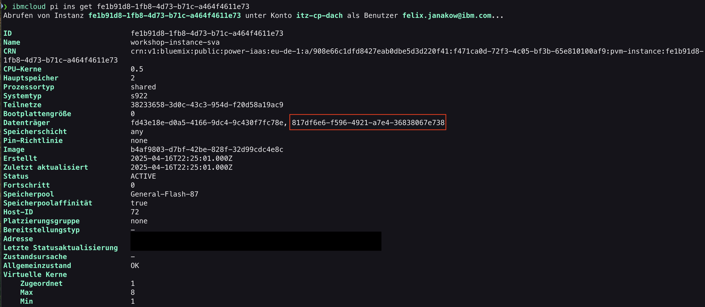

> [!TIP]
> Um rauszufinden welche ID zu einem bestimmten Volume gehört, navigieren Sie über **Storage volumes** auf Ihr Volume, hier sollten Sie die ID sehen
>
> 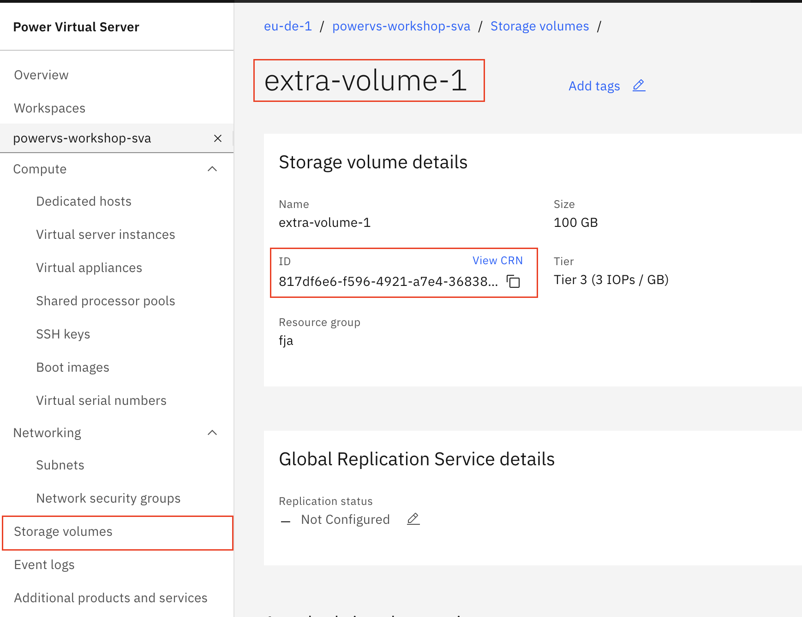

---
#### Snapshot von Instanz + Volume

- Kreiren Sie einen Snaphot der Instanz + Volume mit dem Befehl ``ibmcloud pi ins snap cr <ID_Instanz> --name <wählen_sie_einen_Namen> --volumes <ID_Volume>``

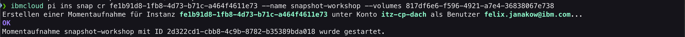

- Um den Snapshot zu suchen und die ID des Snapshots herauszufinden nutzen Sie den Befehl ``ibmcloud snap ls``

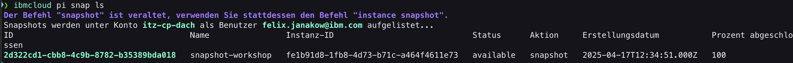

- Um den Snapshot für eine Wiederherstellung zu nutzen müssen Sie die LPAR zuerst herunterfahren.
    - Gehen Sie zum herunterfahren über **Ihren Workspace** unter **Compute** auf **Virtual Server Instances**, wählen Sie Ihre Instanz aus und klicken Sie ganz rechts oben, auf der höhe des Namens, auf das Icon mit den 3 Punkten, klicken Sie dann auf ``OS Shutdown``

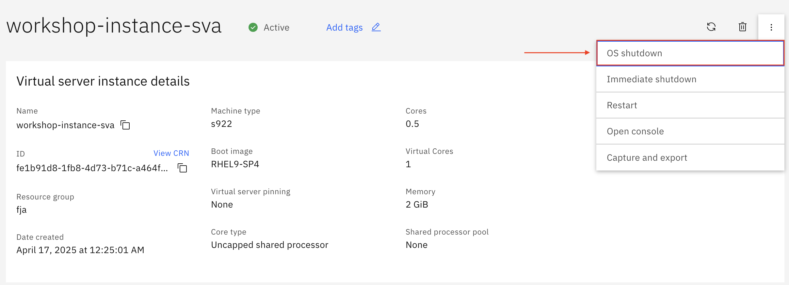

- Sobald die LPAR heruntergefahren ist können Sie den restore durchführen
- Der Befehl für einen Restore sieht wie folgt aus: ``ibmcloud pi ins snap restore <ID_Instanz> --snapshot <ID_Snapshot>``
- Wenn der Befehl erfolgreich gestartet wurde, sollte der Restore des Snapshots erfolgreich sein

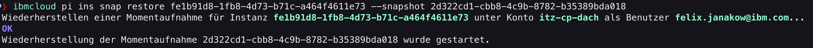

- Schalten Sie zum Schluss Ihre LPAR wieder aktiv
    - Die LPAR kann genauso gestartet werden wie Sie heruntergefahren wurde, navigieren Sie über das Icon mit den 3 Punkten und wählen Sie ``Start``

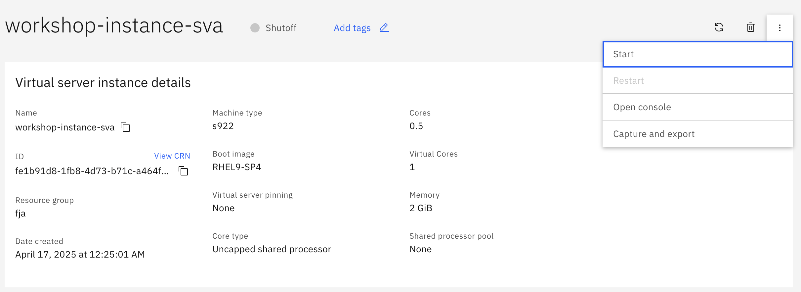

---
#### Instanz Volume clonen

 - Um ihr Volume zu clonen müssen Sie zuerst die ID des zu clonenden Volumes herausfinden, am besten machen Sie dies mit dem Befehl ``ibmcloud pi vol ls``
 - Suchen Sie sich das Volume aus, welches Sie clonen möchten und kopieren Sie sich die ID
 - Clonen Sie ihr Volume mit dem Befehl ``ibmcloud pi vol cla cr <clone_name> --volumes <ID_volume>``

 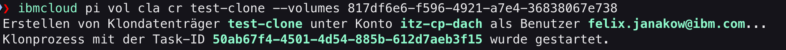

 - Wenn Sie jetzt jetzt wieder Ihre Volumes mit ``ibmcloud pi vol ls`` auflisten, müsste das geclonte Volume unter dem von Ihnen vergebenen Namen sichtbar sein

 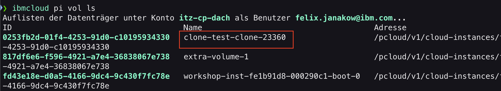

