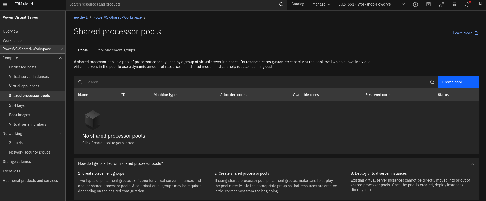
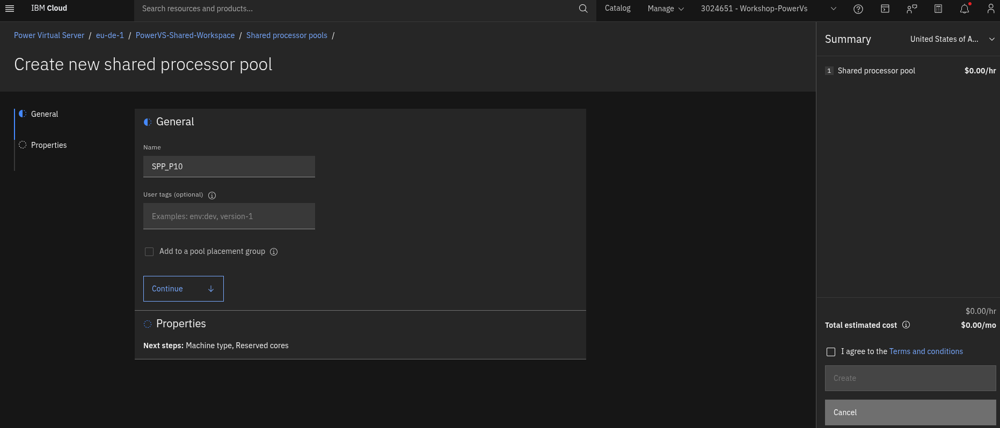
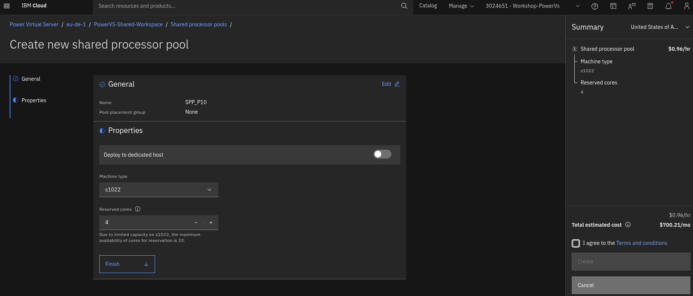
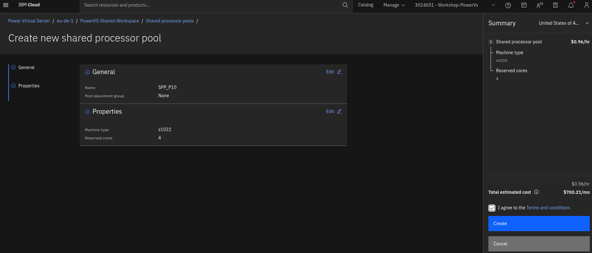
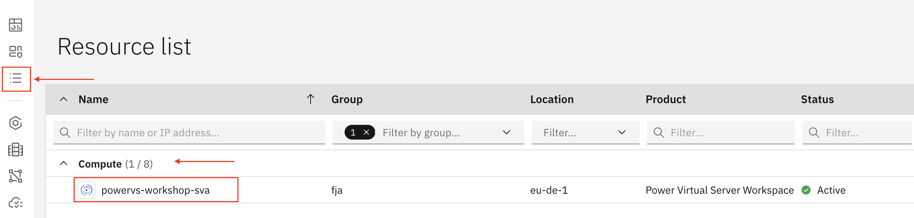
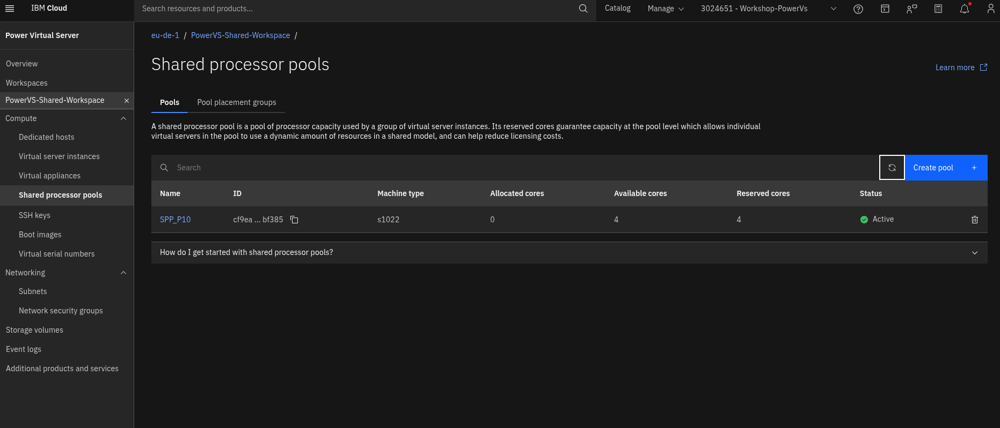
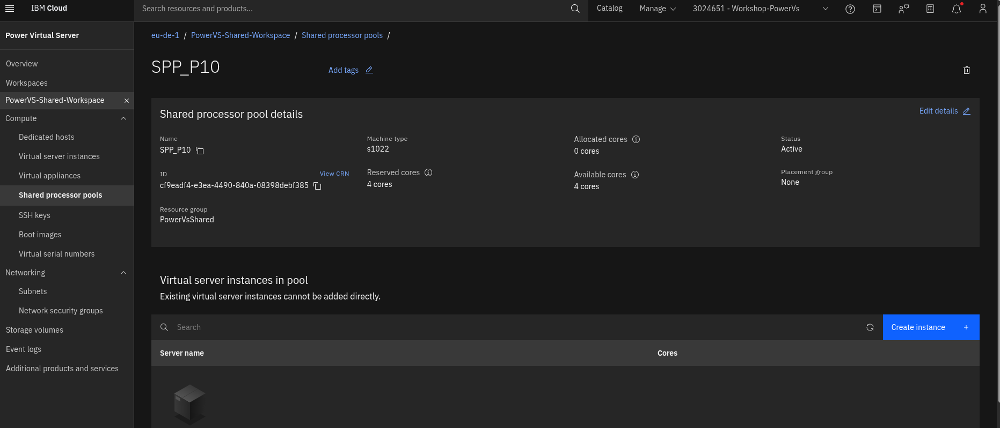
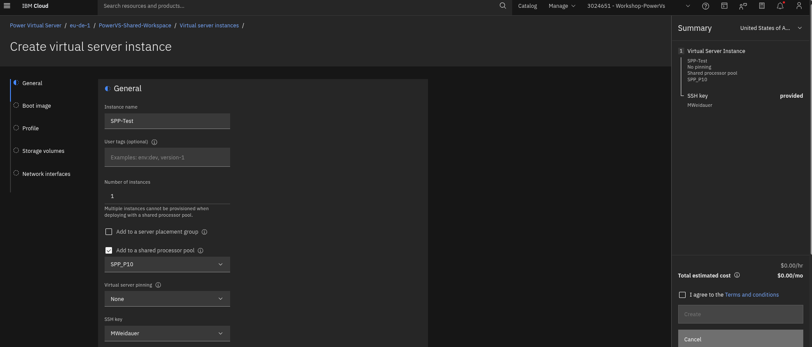
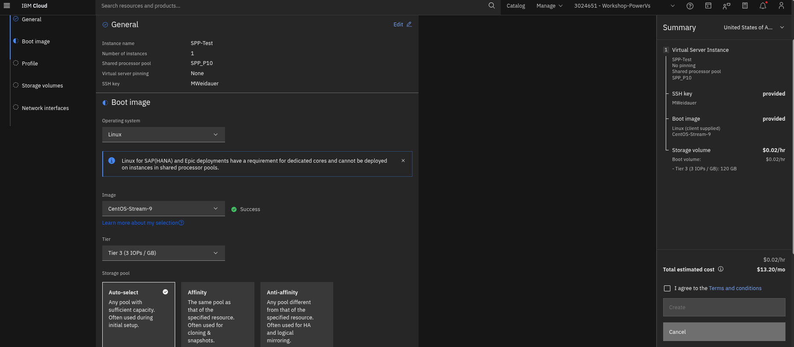
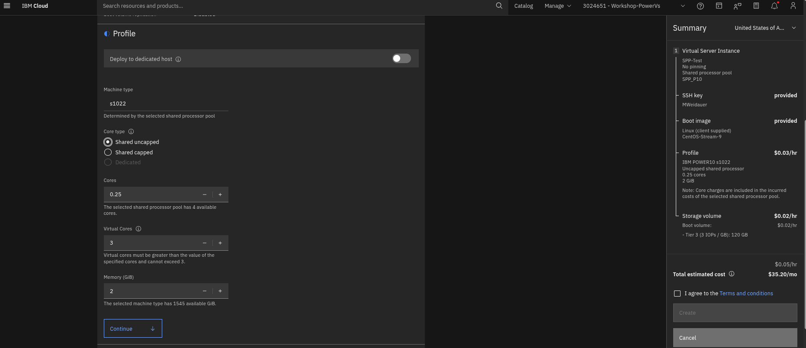

# 04_SPP_Shared_Processor_Pool

> [!NOTE]
> In dieser Übung geht es darum, die Verwendung eines Shared Processor Pools auszuprobieren. Dafür nutzen wir einen gemeinsamen Workspace. **Bitte legen Sie keinen Shared Processor Pool in Ihrem Workspace an**, um keine zusätzlichen Kosten zu verursachen.

----
### Anlegen eines Shared Processor Pools

> [!NOTE]
> Beschreibung der Vorgehensweise. Bitte nur als Trockenübung nachvollziehen, aber keinen SPP anlegen!

- Im Power VS Workspace links **Shared Processor Pools** auswählen und rechts auf ``Create Pool +`` gehen

- Dem Pool einen eindeutigen Namen geben
- Optional Tags eintragen
- Optional Pool einer placement group zuordnen
- Mit ``Continue`` weiter gehen

- (nicht Teil der Übung) Wenn der Pool auf einem Dedicated Host angelgt werden soll, die entsprechende Option aktivieren
- Machine Type auswählen (s922, e980, s1022, e1080), für diese Übung wurde eine s1022 ausgewählt

> [!NOTE]
> Shared Processor Pools auf P9 Systemen haben eine fixe 1 EC : 1 VP Zuordnung. Auf P10 Systemen kann die Zuordnung auf bis zu 1 EC : 3 VP geändert werden, sofern die konfigurierten LPARs über max. 2 Cores verfügen

- Reserved Cores auswählen, für diese Übung wurden 4 Cores konfiguriert
- Auf der rechten Seite wird der Preis für den SPP angezeigt (stundlich/monatlich). Dieser Preis fällt an, solange der Pool exisitert = Kapazitätsreservierung. Für CPUs der im Pool laufenden LPARs fallen keine (weiteren) Kosten an.

- Click ``Finish``
- Häkchen bei den Terms and Conditions setzen
- Click ``Create``

- Das Anlegen des Pools dauert einige Minuten

----
### Shared Processor Pool im Shared Power VS Workspace öffnen

- Navigieren sie über die Ressource List und **Compute** Kategorie zum Workspace **PowerVS-Shared-Workspace**

- Dort links auf **Shared processor pools** gehen
- Aus der Liste den vorhandenen **SPP_P10** auswählen

----
### LPAR im Shared Processor Pool anlegen

> [!NOTE]
> Der Shared Processor Pool für diese Übung ist mit 4 Cores klein bemessen. Bitte legen sie nur minimale LPARs an (0,25 Cores).

- In der Detailansicht des Shared Processor Pools ``Create Instance+`` auswählen

- Das Anlegen einer neuen Instanz unterscheided sich zunächst nur vom aus [01](01_Workspace_anlegen.md) bekannten Vorgehen, durch die Auswahl des **SPP-P10** Pools, in den hinein deployed werden soll
- LAPR Name, Virtual processor pinning und SSH-Key (wie bekannt) konfigurieren und mit ``Continue`` weitergehen 

- Boot Image und Storage Tier (wie bekannt) konfigurieren und mit ``Continue`` weitergehen 
> [!NOTE]
> Beachten Sie den Hinweis zu SAP. Da (produktive) SAP Systeme Dedicated Cores erfordern, um von SAP als Supported betrachtet zu werden, können diese LPARs nicht in Shared Processor Pools deployed werden. Entsprechend sind SAP Boot Images nicht auswählbar.

- Der Pool gibt das System - in unserem Fall s1022 - vor
- Core Types (außer Dedicated), Cores und RAM können so wie bereits bekannt konfiguriert werden.
> [!NOTE]
> Beachten Sie die Möglichkeit die Zahl der **Virtual Cores** zu ändern (1-3), sofern Sie nicht mehr als 2 Cores für die LPAR konfigurert haben. Probieren sie etwas herum!

> [!NOTE]
> Im Sinne der Übung ist es nicht notwendig eine LPAR im Pool anzulegen, da lediglich das Konfigurieren der Virtual Cores demonstriert werden sollte. Wenn Sie eine LPAR anlegen möchten, verfahren sie weiter mit Storage und Netzwerk wie in [Übung 01](01_Workspace_anlegen.md).

