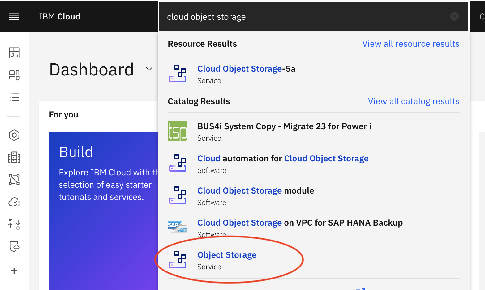
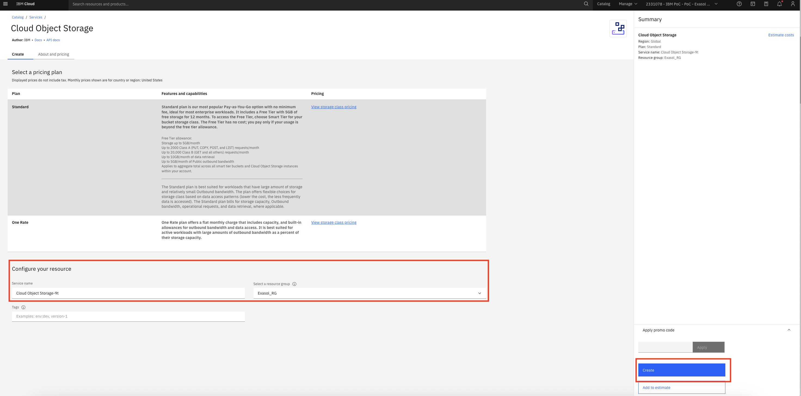
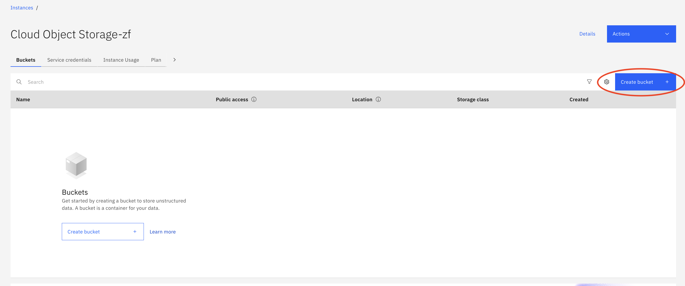
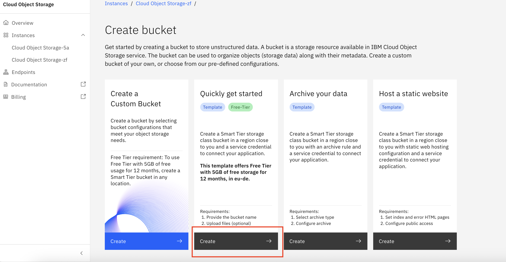
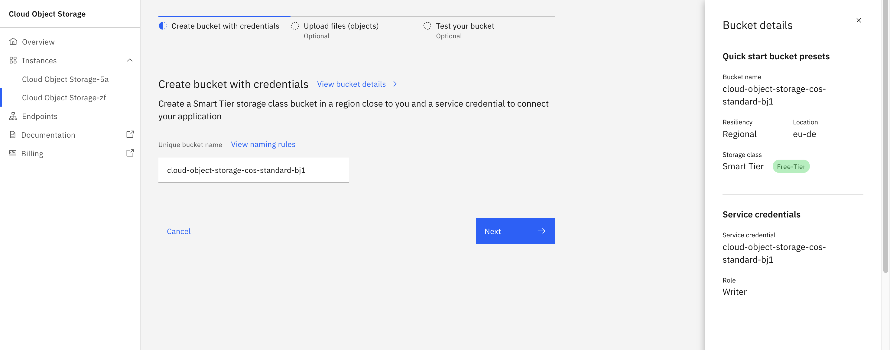
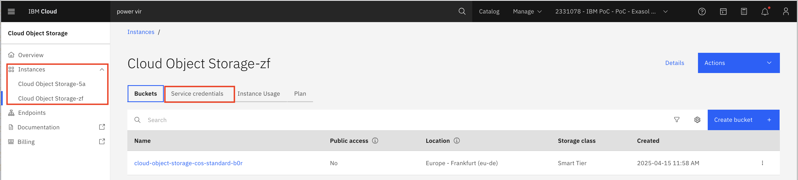
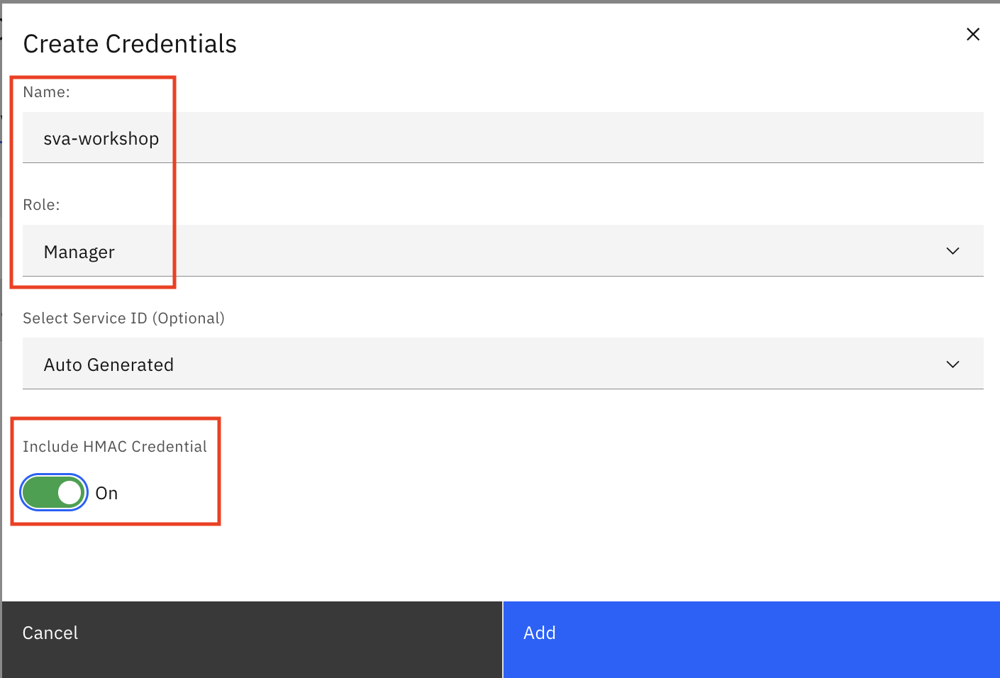
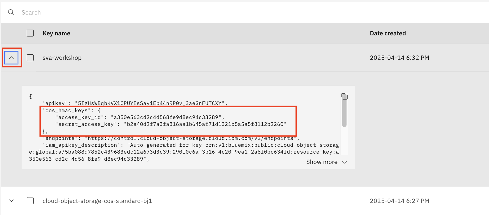
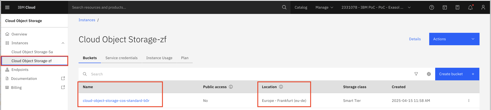
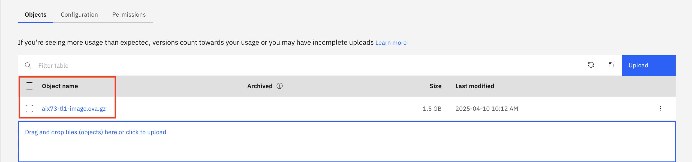

# 10a_COS Service und Bucket erstellen

## Vorgehen
1. COS Service Instanz erstellen
2. Im COS Service einen COS Bucket erstellen
3. Zusätzliche Service Credentials mit "Include HMAC Credential" erstellen
4. Service Credentials anzeigen und kopieren für den Image Transfer
5. OS Image Datei / andere Dateien in Bucket hochladen für Image Transfer in Power Virtual Server Workspace

## Erstellen COS Service Instanz und COS Bucket

- Im IBM Cloud Catalog nach „Object Storage“ suchen und diesen Service auswählen:

- Standard Pricing Plan wählen, nach unten scrollen und ggfs. den Service Name und Resource Group ändern. Rechts Create klicken.

- Die Service Instanz wird angezeigt, ein Bucket kann erstellt werden. Klick Create bucket:

- Gewünschte Bucket Art auswählen und Create klicken - für das Lab z.B. Quickly get started (oder Create a Custom Bucket):
  

- Ggfs. Name des Buckets ändern, Next klicken, wenn gewünscht, können im nächsten Schritt gleich Dateien hochgeladen werden. 
Wenn die Dateien später hochgeladen werden, auf Next klicken, die Bucket Configuration wird automatisch angezeigt. 

## Erstellen und Anzeigen/Kopieren der Service Credentials

In der COS Service Instanz auf das Tab Service Credentials wechseln. Die bei der Erstellung des COS Buckets angelegten Service Credentials werden angezeigt. Diese beinhalten allerdings keine HMAC Keys, welche aber für den Image Transfer erforderlich sind. Eine Änderung der bestehenden Credentials ist nicht möglich, daher werden zusätzliche Credentials angelegt:

- Klick New Credentials
- Name eingeben, Rolle (z.B. Manager) auswählen, Include HMAC Credential auf ON stellen, Add klicken:

Für den Image Transfer werden folgende Informationen benötigt: Region, Image filename, Bucket name, HMAC access key, HMAC secret access key.

- Anzeigen und Kopieren der Service Credentials: Erweitern des "Twisties" neben dem Service Credential Namen, Copy and Paste der Zugriffsdaten, insbesondere der HMAC access und secret access keys:

## Weitere Daten für Image Transfer anzeigen
 
Die Region und den Bucket name findet man in der COS Service Instance:

Der Image filename wird im COS Bucket unter Objects gezeigt - Klick auf Bucket Name: 

