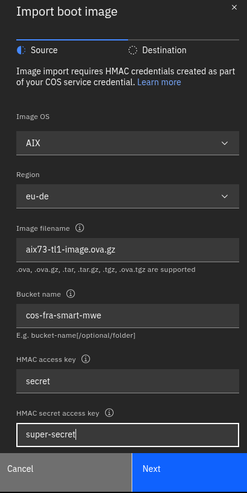
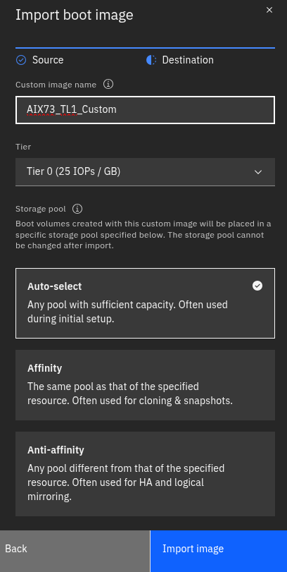
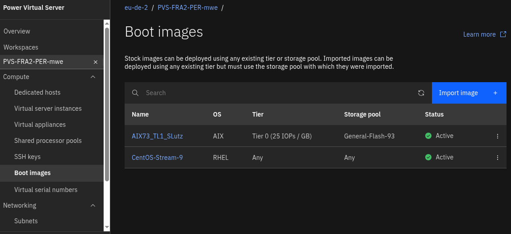
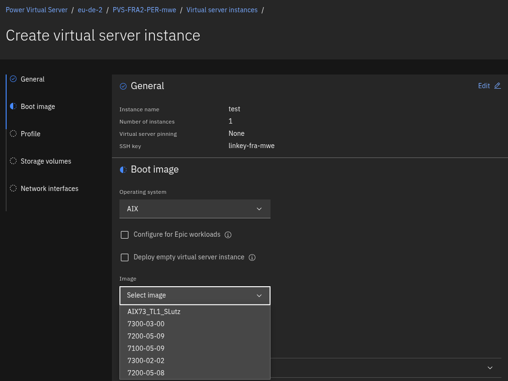

# 10_Image_Import

## Pre Reqs und Randbedingungen:
- Image muss Cloud ready sein (cloud init), z.B. PowerVC oder PowerVS Export
- Unterstützte Dateiformate: tar und ova
- Unterstützte File-Extensions: .ova, .ova.gz, .tar, .tar.gz, .tgz and .ova.tgz
- Image muss in einem COS Bucket gespeichert sein (via private endpoint erreichbar, HMAC credentials verfügbar) [Anleitung](10a_COS_Service+Bucket.md)
- Es ist immer nur eine Image Operation pro Workspace möglich. Bis das Image importiert wurde, ist z.B. auch kein weiterer Image Im-/Export möglich.
- Der Image Import dauert ... lange ...
- Eine sinnvolle Obergrenze für ein zu importierendes Image ist 2TB.

## Vorgehen
- Image liegt wie oben beschrieben im erreichbaren COS Bucket vor
- Im Power VS Workspace auf ``Boot Images`` gehen, dort ``Import Image`` clicken und die erforderlichen Daten eingeben
    - Image OS: Das im Image enthaltene OS auswählen
    - Region: Die COS Region auswählen, in dem sich der Bucket mit dem OS Image befindet
    - Image filename: Dateiname (exakt so geschrieben, wie die Datei im COS gespeichet ist incl. Dateityp/Extension)
    - Bucket name: Name des COS Buckets, in dem sich das OS Image befindet 
    - HMAC access key: aus der COS Bucket Konfiguration
    - HMAC secret access key: aus der COS Bucket Konfiguration
    - ``Next``

- Name des Images eingeben (muss unique sein; erscheint so im Image-Katalog)
- Storage Tier auswählen, mit dem das Image per default deployed werden soll
- Storage Pool/Afinity/Anti-Affinity auswählen
- ``Next``

- Der Image Import erfolgt im Hintergrund, eine Forschrittsanzeige gibt es leider aktuell nicht
- Je nach Image Größe kann der Import lange (Stunden) dauern
- Soabald das Image im Status Active ist, kann es für Deployments verwendet werden

- Das importierte Image wird automatisch in den Image Katalog des Workspaces eingebunden
- Beim Erstellen von LPARs kann das Image aus dem Katalog ausgewählt werden

