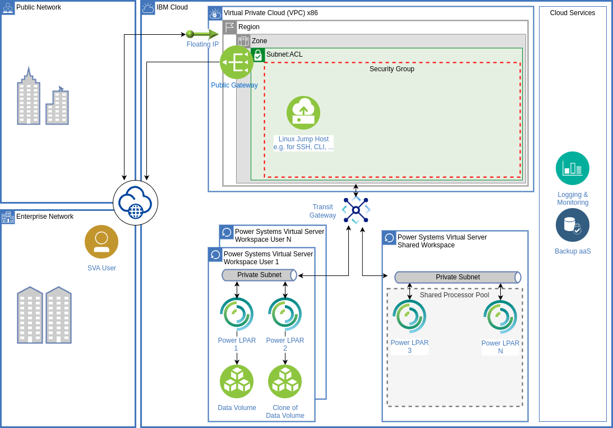

# PowerVS-Workshop-SVA
## Workshop Beschreibung: 
In diesem Workshop werden grundlegende und fortgeschrittenere Techniken zur Verwaltung von Power Virtual Servern Hands-On vermittelt. Der Workshop wendet sich an IT-Architekten, Administratoren und technische Fachkräfte, die ihre Fähigkeiten im Umgang mit Power Virtual Servern erweitern möchten.

Das nachstehende Diagramm zeigt den Aufbau der Hands-On Umgebung, die verwendet wird und teilweise durch die beschriebenen Übungen aufgebaut wird.

## Vorbereitung der Hands-On Umgebung:
Zur Vorbereitung der Hands-on Übungen wurden folgende Schritte bereits durchgeführt, so dass die Workshopteilnehmer eine Umgebung vorfinden, die durch die Übungen zu einem funktionsfähigen Gesamtsystem ausgebaut werden kann.

- Anlegen eines IBM Cloud Sub-Accounts für diesen Workshop im SVA Enterprise Account
- Anlegen von Ressource Groups (RGs) (1x Shared, 11x für Teilnehmer)
- Rechtevergabe in Access Groups (AGs) für die Workshopteilnehmer und den Workshop Admin
- Einladung der Workshopteilnehmer in den IBM Cloud Account incl. Zuordnung zu RGs und AGs
- Anlegen eines Power VS Workspaces mit Shared Processor Pool in der Shared RG
- Deployment von IBM Cloud Monitoring in der Shared RG zur gemeinsamen Nutzung
- Deployment einer Virtual Private Cloud (VPC) incl. Linux Jump Host in der Shared RG zur gemeinsamen Nutzung
- Deployment eines Transit Gateway zur Verbindung von VPC und Power VS Workspaces

## Inhalte des Workshops - Hands-On Übungen:

### [01_Workspace_anlegen:](https://github.ibm.com/felix-janakow/PowerVS-Workshop/blob/main/01_Workspace_anlegen.md)

- PowerVS Workspace anlegen
- Subnetz anlegen
- SSH Key anlegen
- mit SSH Key auf LPAR anmelden:

### [02_LPAR_Management:](https://github.ibm.com/felix-janakow/PowerVS-Workshop/blob/main/02_LPAR_Management.md)

- Rezising der bestehenden LPAR 
- Zugriff auf Console
- Volume hinzufügen

### [03_CLI_+_Storage:](https://github.ibm.com/felix-janakow/PowerVS-Workshop/blob/main/03_CLI_%2B_Storage.md) 

- CLI lokal installieren
- CLI im GUI der IBM Cloud
- CLI Basic Commands
- Snapshot + Restore mit CLI
- Volume klonen und an neue LPAR anhängen mit CLI

-----

##### [Weiterer mit Step 1](https://github.ibm.com/felix-janakow/PowerVS-Workshop/blob/main/01_Workspace_anlegen.md)

